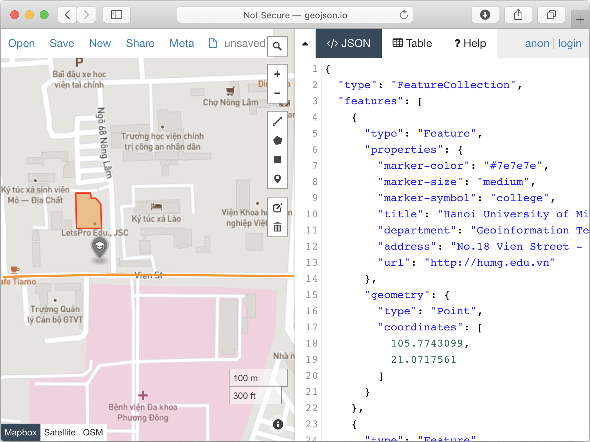

# GeoJSON package for Dart and Flutter developers

GeoJSON package for Dart and Flutter developers to create, read, search, update and delete the geospatial data interchange format (GIS data). This package was originally published by Chuyen, T. T. (2020). The GeoJSON package for Dart and Flutter developers. Zenodo. https://doi.org/10.5281/ZENODO.3841927.

GeoJSON package support GeoJSON objects like spatially bounded entity (a Feature), or a list of Features (a FeatureCollection). GeoJSON supports the following geometry types like Point, LineString, Polygon, MultiPoint, MultiLineString, MultiPolygon, and GeometryCollection. Features in GeoJSON contain a Geometry object and additional properties, and a FeatureCollection contains a list of Features.

## GeoJSON UML Model


## Usage
### Read the GeoJSON file
```dart
import 'package:geojson_vi/geojson_vi.dart';

void main() {
  
  // # Read the GeoJSON file
  var launchTime = DateTime.now();
  await GeoJSON.load('example/data/parcels_82mb.geojson').then((GeoJSON geoJSON) {
    print(geoJSON.featureCollection.features.length);
    print(DateTime.now().difference(launchTime));
  });
}
```
### Read the GeoJSON file async
```dart
import 'package:geojson_vi/geojson_vi.dart';

Future<void> main() async {

  // # Read the GeoJSON file async
  var launchTime = DateTime.now();
  var geoJSON = await GeoJSON.load('example/data/parcels_82mb.geojson');
  print(geoJSON.featureCollection.features.length);
  print(DateTime.now().difference(launchTime));
}
```
### Create new GeoJSON with a Feature
Create an empty GeoJSON file, then add a feature and save it.
```dart
import 'package:geojson_vi/geojson_vi.dart';

void main() {
  // ### Create new GeoJSON with a Feature
  // Create an empty GeoJSON file, then add a feature and save it.
  
  // New GeoJSON
  final geoJSON = GeoJSON.create('example/data/new.geojson');
  // TODO: your code here...
  await geoJSON.save();
}
```
### Create the Feature
```dart
import 'package:geojson_vi/geojson_vi.dart';

void main() {
  
  // ### Create a Feature with Point geometry
  
  // New GeoJSON
  final geoJSON = GeoJSON.create('example/data/new.geojson');

  // One position
  final pos = <double>[];
  pos.add(105.7743099);
  pos.add(21.0717561);
  // or pos.addAll([105.7743099,21.0717561]);

  // Create a Point geometry from one position
  final geom_point = GeoJSONPoint(pos);
  
  // Create a Feature
  final feature_point = GeoJSONFeature(geom_point);
  feature_point.properties['marker-color'] = '#7e7e7e';
  feature_point.properties['marker-size'] = 'medium';
  feature_point.properties['marker-symbol'] = 'college';
  feature_point.properties['title'] = 'Hanoi University of Mining and Geology';
  feature_point.properties['department'] = 'Geoinformation Technology';
  feature_point.properties['address'] = 'No.18 Vien Street - Duc Thang Ward - Bac Tu Liem District - Ha Noi, Vietnam';
  feature_point.properties['url'] = 'http://humg.edu.vn';

  // Add the feature to featureCollection
  geoJSON.featureCollection.features.add(feature_point);

  // ### Create a Feature with LineString geometry
  
  // LineString from 3 positions
  final pos1 = [105.7771289,21.0715458];
  final pos2 = [105.7745218,21.0715658];
  final pos3 = [105.7729125,21.0715358];
  
  // Create a LineString geometry from array of position
  final geom_line_string = GeoJSONLineString([pos1, pos2, pos3]);
  
  // Create a Feature 
  final feature_line_string = GeoJSONFeature(geom_line_string);
  feature_line_string.properties['stroke'] = '#7e7e7e';
  feature_line_string.properties['stroke-width'] = 2;
  feature_line_string.properties['stroke-opacity'] = 1;
  feature_line_string.properties['title'] = 'Vien St.';
  
  // Add the fearture to featureCollection
  geoJSON.featureCollection.features.add(feature_line_string);

  // ### Create a Feature with Polygon geometry
  
  // A linear ring is a closed LineString with four or more positions.
  // The first and last positions are equivalent, and they MUST contain
  // identical values; their representation SHOULD also be identical.
  final p01 = [105.7739666,21.0726795]; // The first position
  final p02 = [105.7739719,21.0721991];
  final p03 = [105.7743394,21.0721966];
  final p04 = [105.7743310,21.0725269];
  final p05 = [105.7742564,21.0726120];
  final p06 = [105.7741865,21.0726095];
  final p07 = [105.7741785,21.0726746];
  final p08 = [105.7739666,21.0726795]; // The last position

  //The exterior ring (boundary)
  final linerRing = [p01,p02,p03,p04,p05,p06,p07,p08];
  
  // Create a Polygon geometry from array of position
  final geom_polygon = GeoJSONPolygon([
    linerRing,
    // and others the interior rings (if present) bound holes within the surface
  ]);
  
  // Create a Feature
  final feature_polygon = GeoJSONFeature(geom_polygon);
  feature_polygon.properties['stroke'] = '#555555';
  feature_polygon.properties['stroke-width'] = 2;
  feature_polygon.properties['stroke-opacity'] = 1;
  feature_polygon.properties['fill'] = '#ab7942';
  feature_polygon.properties['fill-opacity'] = 0.5;
  feature_polygon.properties['title'] = 'HUMG\'s Office';

  // Add to featureCollection
  geoJSON.featureCollection.features.add(feature_polygon);

  geoJSON.save();

  // # Read the GeoJSON file
  var launchTime = DateTime.now();
  await GeoJSON.load('example/data/parcels_82mb.geojson').then((GeoJSON geoJSON) {
    print(geoJSON.featureCollection.features.length);
    print(DateTime.now().difference(launchTime));
  });

  // Calculate area of polygon
  await GeoJSON.load('example/data/polygon_with_holes.geojson').then((value) {
    value.featureCollection.features.forEach((element) {
      if (element.geometry.type == GeometryType.polygon) {
        GeoJSONPolygon pg = element.geometry;
        print('Area: ${pg.area}');
      }
    });
  });

  // Search by geometry and properties
  var polygonFeatures = geoJSON.featureCollection.features.where((element) {
    return (element.geometry.type == GeometryType.polygon && (element.properties['title']).contains('HUMG'));
  }).toList();

  print(polygonFeatures.isNotEmpty ? polygonFeatures.first.toMap : 'not found');
}
```
Output: ```new.geojson```
```JavaScript
{
  "type": "FeatureCollection",
  "features": [
    {
      "type": "Feature",
      "properties": {
        "marker-color": "#7e7e7e",
        "marker-size": "medium",
        "marker-symbol": "college",
        "title": "Hanoi University of Mining and Geology",
        "department": "Geoinformation Technology",
        "address": "No.18 Vien Street - Duc Thang Ward - Bac Tu Liem District - Ha Noi, Vietnam",
        "url": "http://humg.edu.vn"
      },
      "geometry": {
        "type": "Point",
        "coordinates": [
          105.7743099,
          21.0717561
        ]
      }
    },
    {
      "type": "Feature",
      "properties": {
        "stroke": "#7e7e7e",
        "stroke-width": 2,
        "stroke-opacity": 1,
        "title": "Vien St."
      },
      "geometry": {
        "type": "LineString",
        "coordinates": [
          [
            105.7771289,
            21.0715458
          ],
          [
            105.7745218,
            21.0715658
          ],
          [
            105.7729125,
            21.0715358
          ]
        ]
      }
    },
    {
      "type": "Feature",
      "properties": {
        "stroke": "#555555",
        "stroke-width": 2,
        "stroke-opacity": 1,
        "fill": "#ab7942",
        "fill-opacity": 0.5,
        "title": "HUMG's Office"
      },
      "geometry": {
        "type": "Polygon",
        "coordinates": [
          [
            [
              105.7739666,
              21.0726795
            ],
            [
              105.7739719,
              21.0721991
            ],
            [
              105.7743394,
              21.0721966
            ],
            [
              105.774331,
              21.0725269
            ],
            [
              105.7742564,
              21.072612
            ],
            [
              105.7741865,
              21.0726095
            ],
            [
              105.7741785,
              21.0726746
            ],
            [
              105.7739666,
              21.0726795
            ]
          ]
        ]
      }
    }
  ]
}
```
Quick viewing on geojson.io


## Reference
H. Butler, M. Daly, A. Doyle, S. Gillies, S. Hagen, and T. Schaub, "The GeoJSON Format", August 2016, https://tools.ietf.org/html/rfc7946.


## Features and bugs

Please file feature requests and bugs at the [issue tracker][tracker].

[tracker]: https://github.com/chuyentt/geojson_vi/issues